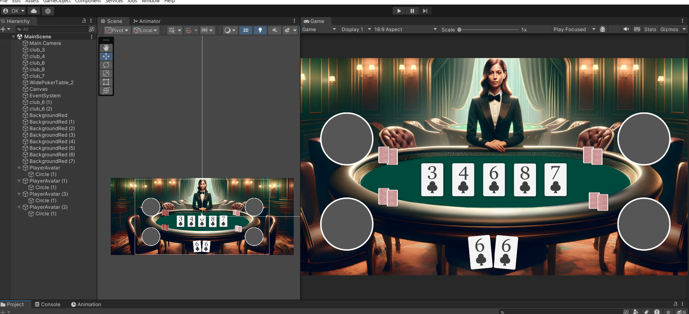

# Unity - Poker Game with Firebase integration

Made with Unity 2022.3.0f1 LTS 

----------
<!-- TABLE OF SECTIONS -->
  # Sections
  <ol>
	  <li><a href="#Introduction">Introduction</a></li>
	  <li><a href="#GDD">GDD</a></li>
	  <li><a href="#TeamMembers">Team Members</a></li>
	  <li><a href="#DevLog">Dev Log</a></li>
	  <li><a href="#KnownBugs">Known Bugs</a></li>
	  <li><a href="#Videos">Videos</a></li>
	  <li><a href="#Technical Details">TechnicalDetails</a></li>
	  <li><a href="#Acknowledgements">Acknowledgements</a></li>
  </ol>

----------

<!-- INTRODUCTION -->
## Introduction

A group project assigned by Velo Games.

A classic Texas Hold'em Poker Game made with Unity (with AI bots).

The project includes Firebase integration, which utilizes Authentication for login, Realtime Database for player save data and leaderboards, and Analytics/events for user behavior tracking.

ZIP file for the newest Android build: TBA TBA

----------
<!-- GDD -->
## Game Design Document for the game: 

https://docs.google.com/document/d/1RrYZFcERAm4OzjKxE57lmc0hMOfWjcYncdkV3LErDXQ/edit?usp=sharing

----------
<!-- TEAMMEMBERS -->
## Team Members: 

Özgen Köklü : https://github.com/OzgenKoklu

Ezgi Keserci : https://github.com/ezgiksrci

----------

<!-- DevLog -->
## Dev Log

# Understanding Poker: 

As two developers, we didn't know how to play Texas Hold'em poker, not even a bit. We were clueless about the rules and anything related to it; we just knew it was played with a standard 52-card deck. On the first day, we only played video game versions of poker and attempted to grasp the rules to some extent. Ezgi played Velo and Zynga poker, while Ozgen played Poker Night 1 and 2 by Telltale Games. After a day of playing poker and making random moves, we thought we understood the game better, but in reality, we still lacked substantial knowledge. While writing the core game loop, we continuously searched for the rules and attempted to understand how things actually worked. We are proud to say that this period ended after we learned how the main and side pots functioned, nearly four weeks after initiating the project.

 

"After 20 hours of Poker Night 1 & 2, I'm proud to say I know how Texas Hold'em Poker works. " - Ozgen 

# Making Visual Mockup: 

We designed the scene based on references from Zynga and Velo poker. We generated the background using DALL-E and were careful about the size of the table; it should be neither too big nor too small. The game cards need to fit on it, while different player avatars should also be able to fit the screen, resembling the reference images. We made some aspect ratio adjustments with Adobe Photoshop's generative fill to create side areas, ensuring that the background looks great on all aspect ratios (16:9 or 21:9).

 

# Understanding What we Need:

We endeavored to grasp what was needed by dissecting the game design of poker. We required deck and card systems, a hand comparison algorithm, a core game loop to support progression, and AI bots to facilitate advancement. As two developers, one of us focused on hand comparison algorithms, while the other handled the core loop tasks such as adding dealer selection logic, etc.

# Understanding Hand Comparison Algorithms: 

We began developing the hand algorithms, starting with a more conventional approach. Our initial attempt involved searching through the hands using List methods like .Any, scanning for duplicate cards or a straight. However, this logic proved to have too many oversights. It was resource-intensive, failed to track 'Kicker Cards,' and required looping through the hands repeatedly to address tie situations. Despite attempting to rectify these oversights over the course of 3 or 4 days, we realized the script was becoming excessively lengthy. Further research revealed that hand evaluation was a nuanced topic, one that could easily evolve into a University 'Capstone Project' or a 'Master's Thesis.'

We then discovered Cactus Kev's algorithm and incorporated the corresponding C# library into our project. This method assigns ranks to hands on a scale from 1 to 7462, with the data correlating hands to these values pre-recorded in a hash table. Some hands may receive the same rank if they are equal in strength. By comparing the hand values of each player, we determine the winner. Additional details about this library are available in the GDD and Acknowledgments.

The old Code for evaluation:

https://github.com/OzgenKoklu/Velogames_Unity_PokerGame/blob/a92c4baef895a47e9fc50958030df9cee6680eed/PokerGame/Assets/Scripts/PokerHandEvaluator.cs

# AI bot Action: 

AI bots were designed to act based on their hand strength. First, we evaluate the hand, assigning it a value from 1 to 7462, as mentioned in the earlier paragraph. We then assign a rating such as 'amazing' or 'strong' based on this value. For example, a three of a kind is a pretty good hand that rarely occurs, so it is considered a strong hand in our algorithm.

At any given time, for a given hand rating, an AI player will make one of two choices. If it's a weak hand, the AI will fold or check. A good hand will result in either a check or a bet. The likelihood of choosing the more aggressive action depends on a few other parameters, such as the ratio of the call amount to the player's current stack. It's nothing too complex, but in my opinion, it works well enough for a game of this scale.

# Putting it all together:

Okay, we have everything ready, so we can complete the game now, right? WRONG. At the beginning, we thought that creating all the game "states" such as preflop, flop, river, etc., and transitioning between them until the showdown would be a walk in the park. However, as a game that depends on more than one condition, getting those conditions to work together was more complex than initially assumed. For example, an All-in player was an afterthought for our system. The game needs to stop taking any more actions from this player, and the pot logic should be rewritten because an all-in player means other players might go beyond their bet amount, necessitating a pot split. During these realizations, we discovered layers and layers of complexity within this seemingly simple project.

   

Image: Pot split, winner selection, game loop completed. 30.04.2024

# Firebase integration: 
  
-firebase integration (login save data, events/analytics.) 

----------
<!-- KnownBugs -->
## Known Bugs to adress for the ??.03.2024 - Final Commit: 

1) 

----------

<!-- Videos -->
## Videos

??.05.2024 - Working in editor: 

NOTES

----------

<!-- TechnicalDetails -->
## TechnicalDetails

-What should we put here hm?

----------

<!-- Acknowledgements -->
## Acknowledgements

A non profit project. 

## Libraries:

Poker Hand Evaluator (Kev's algorithm)

https://github.com/HenryRLee/PokerHandEvaluator

C# adaptation of this repo:

https://github.com/travisstaloch/PokerHandEvaluator.cs

## In Game Assets:

Main Background:

AI image generation. Dall-E - GPT4

Playing Cards: 

Casino Pack 1001com

https://opengameart.org/content/casino-pack

Player Avatars

Pexels Stock images: (CC0)
Photo by Andrea Piacquadio: https://www.pexels.com/photo/closeup-photo-of-woman-with-brown-coat-and-gray-top-733872/

Photo by Andrea Piacquadio: https://www.pexels.com/photo/woman-in-collared-shirt-774909/

Photo by Thgusstavo Santana: https://www.pexels.com/photo/man-with-cigarette-in-mouth-1933873/

Photo by Simon Robben: https://www.pexels.com/photo/man-in-brown-polo-shirt-614810/

Photo by Stefan Stefancik: https://www.pexels.com/photo/man-on-gray-shirt-portrait-91227/

Photo by Daniel Xavier: https://www.pexels.com/photo/woman-wearing-black-eyeglasses-1239291/

Photo by Andrea Piacquadio: https://www.pexels.com/photo/man-wearing-red-sweatshirt-and-black-pants-leaning-on-the-wall-845434/

Photo by Tuấn Kiệt Jr.: https://www.pexels.com/photo/woman-posing-for-photo-shoot-1391498/

## Sounds Assets: Unused

## UI Assets: 

